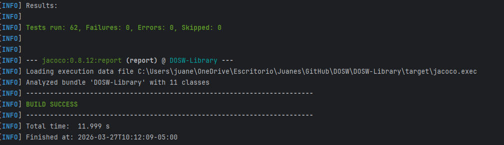
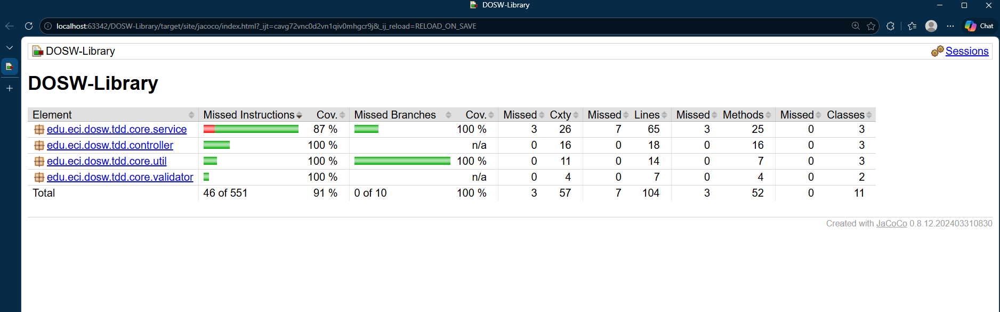

# 📚 DOSW-Library

> Sistema de gestión de biblioteca con persistencia, seguridad JWT y control de inventario — desarrollado para **DOSW Company**.

---

## 📋 Tabla de Contenidos

1. [Descripción del Proyecto](#descripción-del-proyecto)
2. [Tecnologías y Requisitos Previos](#tecnologías-y-requisitos-previos)
3. [Instalación y Ejecución](#instalación-y-ejecución)
4. [Estructura del Proyecto](#estructura-del-proyecto)
5. [Documentación de la API (Swagger)](#documentación-de-la-api-swagger)
6. [Pruebas y Cobertura](#pruebas-y-cobertura)
7. [Análisis Estático](#análisis-estático)
8. [Manejo de Errores](#manejo-de-errores)
9. [Demo Funcional](#demo-funcional)
10. [Autores](#autores)

---

## 📖 Descripción del Proyecto

Este proyecto es una evolución del sistema de gestión de biblioteca de **DOSW Company**. La versión anterior gestionaba libros, usuarios y préstamos mediante una API REST por capas, pero presentaba dos limitaciones críticas:

- ❌ Información manejada **en memoria** (sin persistencia real)
- ❌ Sin mecanismos de **autenticación ni autorización**

### 🎯 Objetivo

Construir una versión robusta que incluya:

-  **Persistencia** en base de datos relacional
-  **Seguridad** basada en JWT (autenticación y autorización)
-  **Autorización por roles** para ciertas operaciones
-  **Control de inventario** de libros
-  **Arquitectura limpia** y desacoplada
-  **Buenas prácticas**: DTOs, MapStruct, validaciones, manejo de errores y pruebas

---

## 🛠️ Tecnologías y Requisitos Previos

### Stack utilizado

-  **Java 21** — lenguaje principal
-  **Spring Boot 3.x** — framework web y de inyección de dependencias
-  **Springdoc OpenAPI (Swagger UI)** — documentación interactiva
-  **JUnit 5 + Mockito** — pruebas unitarias y funcionales
-  **JaCoCo** — reporte de cobertura de pruebas
-  **Checkstyle / SpotBugs** — análisis estático
-  **Maven 3.8+** — gestión de dependencias y ciclo de build

### Requisitos previos

Antes de ejecutar el proyecto, asegúrate de tener instalado:

-  **Java 21** — verificar con `java -version`
-  **Maven 3.8+** — verificar con `mvn -version`
-  **Git**

---

## 🚀 Instalación y Ejecución

```bash
# 1. Clonar el repositorio
git clone https://github.com/JuanTellez125/DOSW-Library.git
cd DOSW-Library

# 2. Compilar y ejecutar
./mvnw spring-boot:run
```

> La aplicación estará disponible en: **http://localhost:8080**

---

## 🗂️ Estructura del Proyecto

```
src/
├── main/
│   └── java/edu/eci/dosw/tdd/
│       ├── controller/
│       │   ├── dto/
│       │   │   ├── BookDTO.java
│       │   │   ├── LoanDTO.java
│       │   │   └── UserDTO.java
│       │   ├── mapper/
│       │   │   ├── BookMapper.java
│       │   │   ├── LoanMapper.java
│       │   │   └── UserMapper.java
│       │   ├── BookController.java
│       │   ├── ErrorResponse.java
│       │   ├── GlobalExceptionHandler.java
│       │   ├── LoanController.java
│       │   └── UserController.java
│       ├── core/
│       │   ├── exception/
│       │   │   ├── BookNotAvailableException.java
│       │   │   ├── LoanLimitExceededException.java
│       │   │   └── UserNotFoundException.java
│       │   ├── model/
│       │   │   ├── Book.java
│       │   │   ├── Loan.java
│       │   │   ├── Status.java
│       │   │   └── User.java
│       │   ├── service/
│       │   │   ├── BookService.java
│       │   │   ├── LoanService.java
│       │   │   └── UserService.java
│       │   ├── util/
│       │   │   ├── DateUtil.java
│       │   │   ├── IdGeneratorUtil.java
│       │   │   └── ValidationUtil.java
│       │   └── validator/
│       │       ├── BookValidator.java
│       │       ├── LoanValidator.java
│       │       └── UserValidator.java
│       └── DoswLibraryApplication.java
└── test/
    └── java/edu/eci/dosw/tdd/
        ├── BookControllerTest.java
        ├── BookServiceTest.java
        ├── LoanControllerTest.java
        ├── LoanServiceTest.java
        ├── UserControllerTest.java
        └── UserServiceTest.java
```

---

## 📄 Documentación de la API (Swagger)

La API está completamente documentada con **Swagger UI**. Con la aplicación en ejecución, accede a la documentación interactiva en:

> 🔗 **http://localhost:8080/swagger-ui/index.html**

Desde esta interfaz puedes explorar y probar todos los endpoints directamente, sin necesidad de herramientas externas como Postman.

---

## 🧪 Pruebas y Cobertura

### Pruebas Unitarias

Se implementaron **62 pruebas** que validan el correcto funcionamiento de servicios, controladores, mappers, validadores y utilidades.



### Cobertura de Pruebas — JaCoCo



---

## 📊 Análisis Estático

Análisis realizado con **SonarQube**:


---

## ⚠️ Manejo de Errores

El sistema cuenta con un `GlobalExceptionHandler` centralizado que captura y responde de forma consistente ante errores de negocio y validación, incluyendo:

- `BookNotAvailableException` — libro no disponible para préstamo
- `LoanLimitExceededException` — límite de préstamos activos superado
- `UserNotFoundException` — usuario no encontrado en el sistema

---

## 🎬 Demo Funcional


---

## 👤 Autor

Juan Esteban Téllez Valencia - DOSW Grupo 2 - Escuela Colombiana de Ingeniería Julio Garavito 